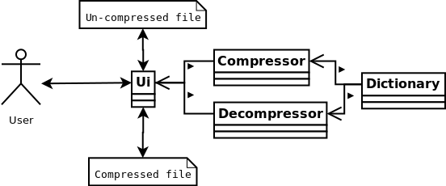

# Design document

I think I have used some kind of compression programs as long as I have been using computers, but I have not really thought about how they work. I have known the basics about them, but actually implementing one will be quite intresting.

The ZipperZapper is a simple application to compress and uncompress files using the [Lempel-Ziv-Welch](https://en.wikipedia.org/wiki/Lempel%E2%80%93Ziv%E2%80%93Welch#Patents) (LZW) algorithm.

This version will be compared against existing implementations (mainly [java.util.zip](https://docs.oracle.com/javase/8/docs/api/java/util/zip/package-summary.html)) to calculate any speed and compression efficiency differences. The expected outcome is that existing optimized implemetations will be both faster and compress better than my own implementation.

## Data structures

The LZW compression is based on a fixed dictionary, usually 4096 bits, so the data structure itself is a binary search tree.

## Complexity

The tree-structure should allow for a linear O(n) complexity, as each input byte should only be read once, but with a fixed dictionary this will probably be a O(n log n) result.

## General overview

The application will allow for input of filename for either encoding or decoding and choosing either the ZipperZapper or the java.util.zip implementation.

A rough outline of the structure.

